# mdbook-mermaid

## 快速上手Mermaid流程图

本文主要介绍了如何快速上手 `Mermaid` 流程图,不用贴图上传也不用拖拉点拽绘制,基于源码实时渲染流程图,操作简单易上手,广泛被集成于主流编辑器,包括 `markdown` 写作环境.

通过本节内容你将学习到以下主要内容:

- 了解什么是流程图以及`Mermaid`流程图;
- 掌握并能记住如何绘制`Mermaid`流程图;
- 了解 `Gitbook` 写作环境的相关集成插件.

## 什么是Mermaid流程图

**关键词**

```mardown
- 项目地址
- 在线编辑
- 官方文档
```

千言万语不如一张图,使用图形展示事物处理流程的图形称之为**流程图**.

`Mermaid`是一个基于 `Javascript` 的图解和制图工具.它基于 `markdown` 语法来简化和加速生成流程图的过程,也不止于生成流程图.

**源码**

```
graph TD
  A[Christmas] -->|Get money| B(Go shopping)
  B --> C{Let me think}
  C -->|One| D[Laptop]
  C -->|Two| E[iPhone]
  C -->|Three| F[fa:fa-car Car]
```

**效果**

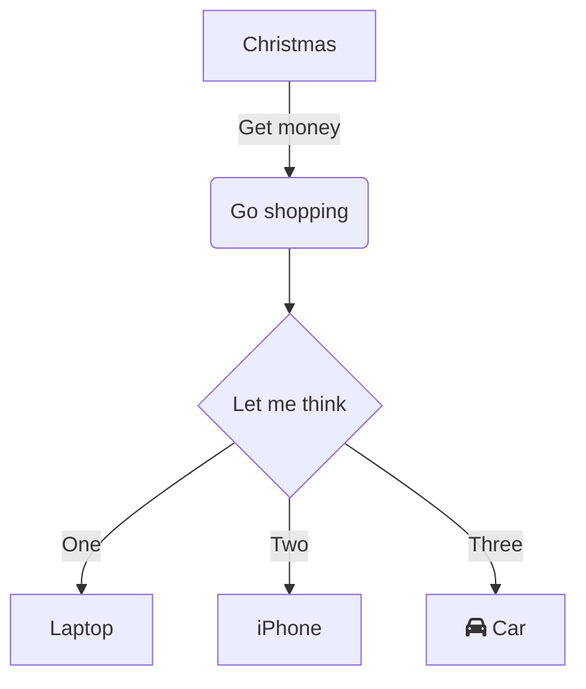

- 项目地址: [https://github.com/mermaid-js/mermaid](https://github.com/mermaid-js/mermaid)
- 在线编辑: [https://mermaidjs.github.io/mermaid-live-editor/](https://mermaidjs.github.io/mermaid-live-editor/)
- 官方文档: [https://mermaid-js.github.io/mermaid/#/flowchart](https://mermaid-js.github.io/mermaid/#/flowchart)
- 官方参考: [https://mermaid.nodejs.cn/syntax/flowchart.html](https://mermaid.nodejs.cn/syntax/flowchart.html)

## Mermaid流程图快速入门

### 布局方向

**关键词**

```markdown
+ TB
+ BT
+ LR
+ RL
```

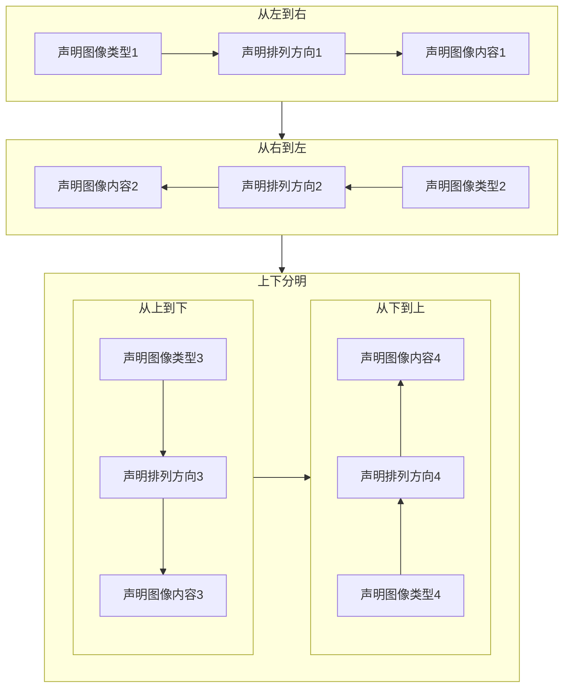

流程图布局方向,由四种基本方向组成,分别是英文单词: `top`(上), `bottom`(下),`left`(左)和 `right`(右).其中可选值: `TB` (从上到下),`BT` (从下到上),`LR` (从左往右)和 `RL` (从右往左)四种.

> **核心**: 仅支持上下左右四个垂直方向,是英文单词首字母大写缩写.

- TB

> 从上到下: from **T**op to **B**ottom

**源码**

```
graph TB
    Start --> Stop
```

**效果**

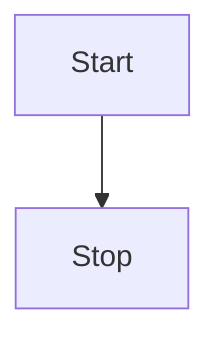

- BT 

> 从下到上: from **B**ottom to **T**op

**源码**

```
graph BT
    Start --> Stop
```

**效果**

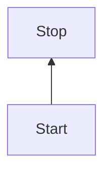

- LR

> 从左往右: from **L**eft to **R**ight

**源码**

```
graph LR
    Start --> Stop
```

**效果**

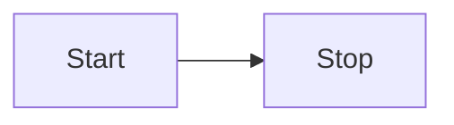

- RL

> 从右往左: from **R**ight to **L**eft

**源码**

```
graph RL
    Start --> Stop
```

**效果**

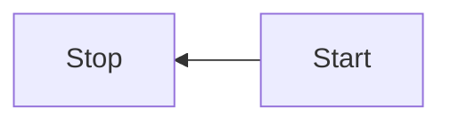

### 形状

**关键词**

```markdown
- 节点形状
    + [矩形]
        - [[暂不支持]]
        - [(圆柱)]
        - [{暂不支持}]
        - [/平行四边形/]
        - [\平行四边形\]
        - [/梯形\]
        - [\梯形/]
    + (圆角矩形)
        - ((圆形))
        - ([体育场])
        - ({暂不支持})
    + {菱形}
        - {{六边形}}
        - {[暂不支持]}
        - {(暂不支持)}
    + >不对称矩形]
```

```mermaid
graph 
    id0
    id1[矩形]
    id2(圆角矩形)
    id3([椭圆])
    id4[[矩形嵌套]]
    id5[(圆柱)]
    id6((圆))
    id7>不对称矩形]
    id8{菱形}
    id9{{六边形}}
    id10[/平行四边形1/]
    id11[\平行四边形2\]
    id12[/梯形1\]
    id13[\梯形2/]
    id14(((双圆)))
    A@{ shape: manual-file, label: "File Handling"}
    B@{ shape: manual-input, label: "User Input"}
    C@{ shape: docs, label: "Multiple Documents"}
    D@{ shape: procs, label: "Process Automation"}
    E@{ shape: paper-tape, label: "Paper Records"}
```

流程图节点形状,默认支持矩形和圆两种基本形状,包括基本形状的简单变体,支持嵌套组合形式,其中 `[]` 表示矩形,`()` 表示圆弧,`{}` 表示尖角(窃以为 `<>` 更适合)等等.

> **核心**: 最外层代表主形状,内层辅助修饰.

#### 一次性节点

一次性节点,默认表现为矩形节点,其文本内容直接显示 `id` 的值,适合后续不会出现多次引用的情况.

> `id` 建议直接写成有意义的文本描述而不是当成唯一标识.

**源码**

```
graph TD
    id
```

**效果**

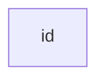

#### 可重复节点

可重复节点,指定节点形状,其文本内容不再是 `id` 的值而是 `<node shape>` 的值,适合后续出现多次引用相同节点的情况.

> `id` 代表节点的唯一标识,当前节点的文本描述由 `<node shape>` 的值指定,建议 `id` 写成有意义的唯一标识.

- 矩形

> 一般格式: `[node description]` ,`[]` 中括号表示节点是**矩形**形状,`node description` 是节点的描述文本.

**源码**

```
graph LR
    id1[This is the text in the box]
```

**效果**


- 圆角矩形

> 一般格式: `(node description)` ,`()` 小括号表示节点是**圆角矩形**形状,`node description` 是节点的描述文本.

**源码**

```
graph LR
    id1(This is the text in the box)
```

**效果**

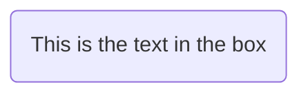

- 体育场

> 一般格式: `([node description])` ,`()` 小括号嵌套 `[]` 中括号表示节点是大弧度的圆角矩形形状,也就是**体育场**形状,`node description` 是节点的描述文本.

**源码**

```
graph LR
    id1([This is the text in the box])
```

**效果**


- 圆柱

> 一般格式: `[(node description)]` ,`[]` 中括号嵌套 `()` 小括号表示节点是**圆柱**形状,`node description` 是节点的描述文本.

**源码**

```
graph LR
    id1[(Database)]
```

**效果**

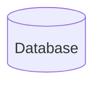

- 圆形

> 一般格式: `((node description))` ,`()` 小括号嵌套 `()` 小括号表示节点是**圆形**形状,`node description` 是节点的描述文本.

**源码**

```
graph LR
    id1((This is the text in the circle))
```

**效果**

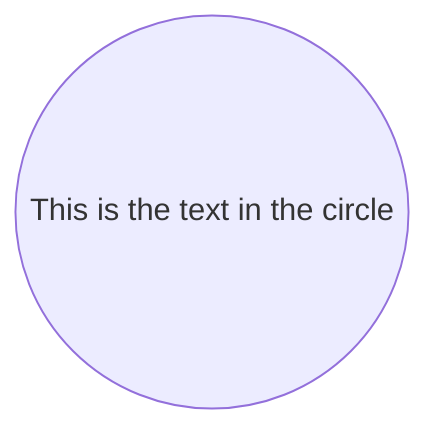

- 不对称矩形

> 一般格式: `>node description]` ,左边是右尖括号 `>` ,右边是右中括号 `]` 表示**不对称矩形**形状,`node description` 是节点的描述文本.

**源码**

```
graph LR
    id1>This is the text in the box]
```

**效果**

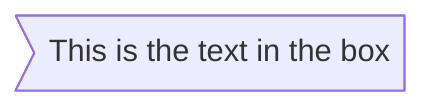

- 菱形

> 一般格式: `{node description}` ,`{}` 大括号表示**菱形**形状,`node description` 是节点的描述文本.

**源码**

```
graph LR
    id1{This is the text in the box}
```

**效果**

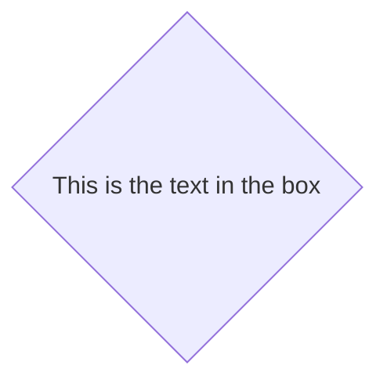

- 六角形

> 一般格式: `{`{`node description`}`}` ,`{}` 大括号嵌套 `{}` 大括号表示**六角形**形状,`node description` 是节点的描述文本.

**源码**

```
graph LR
    id1\{\{This is the text in the box\}\}
```

> `Gitbook` 语法中双大括号 `{}` 表示特殊意义,上述源码只能转义处理,实际上并不需要 `\` 进行转义.

**效果**


- 平行四边形

> 一般格式: `[/node description/]` ,`[]` 中括号嵌套 `//` 左斜杠表示**左斜平行四边形**形状,`node description` 是节点的描述文本.

**源码**

```
graph TD
    id1[/This is the text in the box/]
```

**效果**

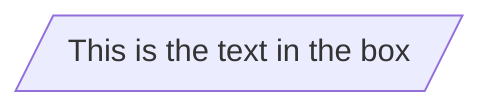

- 平行四边形

> 一般格式: `[\node description\]` ,`[]` 中括号嵌套 `\\` 右斜杠表示**右斜平行四边形**形状,`node description` 是节点的描述文本.

**源码**

```
graph TD
    id1[\This is the text in the box\]
```

**效果**

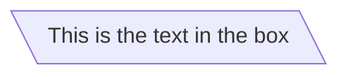

- 梯形

> 一般格式: `[/node description\]` ,`[]` 中括号嵌套 `/\` 左右斜杠表示**上短下长梯形**形状,`node description` 是节点的描述文本.

**源码**

```
graph TD
    A[/Christmas\]
```

**效果**

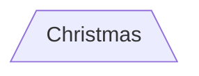

- 另一种梯形

> 一般格式: `[\node description/]` ,`[]` 中括号嵌套 `\/` 右左斜杠表示**上长下短梯形**形状,`node description` 是节点的描述文本.

**源码**

```
graph TD
    B[\Go shopping/]
```

**效果**

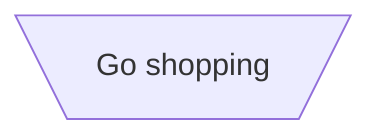

### 连接线

**关键词**

```markdown
+ 实线/虚线
    - --
    - -.
+ 有箭头/无箭头
    - >
    - -
+ 有描述/无描述
    - 实线
        + --描述文字
        + |描述文字|
    - 虚线
        + -.描述文字
        + |描述文字|
+ 加粗
    - ==
+ 组合形式
    - -->
    - ---
    - -.->
    - -.-
    - 有描述实线有箭头
        + --描述文字-->
        + -->|描述文字|
    - 有描述实线无箭头
        + --描述文字---
        + ---|描述文字|
    - 有描述虚线有箭头
        + -.描述文字-.->
        + -.->|描述文字|
    - 有描述虚线无箭头
        + -.描述文字-.-
        + -.-|描述文字|
    - ==>
    - ===
    - 有描述加粗实线有箭头(2)
        + ==描述文字==>
        + ==>|描述文字|
    - 有描述加粗实线无箭头(2)
        + ==描述文字===
        + ===|描述文字|
```

```mermaid
graph TB
    c1-->a2
    subgraph one
    a1-->a2
    c1-->c2
    end
    subgraph two
    b1-->b2
    end
    subgraph fourth
    A1 -- text --> B1
    A2 ~~~ B2
    A3 -->|text| B3
    A4 ==> B4
    A5 --- B5
    A6 -.-> B6
    A7 e1@==> B7
    e1@{ animate: true }
    A8 o--o B8
    A9 <--> B9
    A10 x--x B10
    end
    one --> two
    two --> c2
```


流程图连接线样式,支持实线和虚线以及有箭头样式和无箭头样式,除此之外还支持添加连接线描述文字,其中 `--` 代表实线,实线中间多一点 `-.-` 代表虚线,添加箭头用右尖括号 `>` ,没有箭头继续用短横线 `-`.

> **核心**: 先实线再虚线,先有箭头再去箭头,左边位置添加描述文字需要区分实现还是虚线,右边位置添加描述文字格式一致.

- 有箭头无描述实线

> 一般格式: `-->` ,其中 `--` 表示实线,`>` 表示有箭头.

**源码**

```
graph LR
    A-->B
```

**效果**

```mermaid
graph LR
    A-->B
```

- 无箭头实线

> 一般格式: `---` ,其中 `--` 表示实线,`-` 表示无箭头.

**源码**

```
graph LR
    A --- B
```

**效果**

```mermaid
graph LR
    A --- B
```

- 带描述的有箭头实线

> 一般格式: `--connection line description-->` ,其中左边的 `--` 添加到**实线左边位置**,右边的 `-->` 表示**带箭头的实线**.

**源码**

```
graph LR
    A-- text -->B
```

**效果**

```mermaid
graph LR
    A-- text -->B
```

> 一般格式: `|connection line description|` ,其中 `||` 添加到**连接线右边位置**.

**源码**

```
graph LR
    A-->|text|B
```

**效果**

```mermaid
graph LR
    A-->|text|B
```

- 带描述的无箭头实线

> 一般格式: `--connection line description` ,其中左边的 `--` 添加到**实线左边位置**,右边的 `---` 表示**不带箭头的实线**.

**源码**

```
graph LR
    A-- This is the text ---B
```

**效果**

```mermaid
graph LR
    A-- This is the text ---B
```

> 一般格式: `|connection line description|` ,其中 `||` 添加到**连接线右边位置**.

**源码**

```
graph LR
    A---|This is the text|B
```

**效果**

```mermaid
graph LR
    A---|This is the text|B
```

- 有箭头虚线

> 一般格式: `-.connection line description.->` ,其中左边的 `-.` 添加到**虚线左边位置**,右边的 `.->` 表示**带箭头的虚线**.

**源码**

```
graph LR
   A-. text .-> B
```

**效果**

```mermaid
graph LR
   A-. text .-> B
```

- 有箭头加粗实线

> 一般格式: `==>` ,表示加粗实线.

**源码**

```
graph LR
   A ==> B
```

**效果**

```mermaid
graph LR
   A ==> B
```

- 带描述的有箭头加粗实线

> 一般格式: `==connection line description` ,左边的 `==` 添加到加粗实现左边,右边的 `==>` 代表加粗实线.

**源码**

```
graph LR
   A == text ==> B
```

**效果**

```mermaid
graph LR
   A == text ==> B
```
- 带描述的有箭头加粗实线

> 一般格式: `|connection line description|` ,其中 `||` 添加到**连接线右边位置**.

**源码**

```
graph LR
   A ==>|text| B
```

**效果**

```mermaid
graph LR
   A ==>|text| B
```

### 高级用法

**关键词**

```markdown
+ -->-->
+ &
+ ""
+ %%
+ subgraph
```

```mermaid
graph LR
%% this is a comment A -- text --> B{node}
   A -- text --> B -- text2 --> C["This is the (text) in the box"]
```

- 多节点链式连接

**源码**

支持链式连接方式,`A-->B-->C` 等价于 `A-->B` 和 `B-->C` 形式.

```
graph LR
   A -- text --> B -- text2 --> C
```

**效果**

```mermaid
graph LR
   A -- text --> B -- text2 --> C
```

- 多节点共同连接

支持共同连接方式,`A-->B & C` 等价于 `A-->B` 和 `A-->C` 形式.

**源码**

```
graph LR
   a --> b & c--> d
```

**效果**

```mermaid
graph LR
   a --> b & c--> d
```

- 多节点相互连接

多节点共同连接的变体形式,`A & B --> C & D` 等价于 `A-->C` ,`A-->D`,`B-->C` 和 `B-->D` 四种组合形式.

**源码**

```
graph TB
    A & B--> C & D
```

**效果**

```mermaid
graph TB
    A & B--> C & D
```

- 双引号包裹特殊字符

连接线描述文字存在特殊字符使用双引号 `""` 包裹处理,如遇到 `[]` 和 `()` 以及 `{}` 等特殊字符情况.

**源码**

```
graph LR
    id1["This is the (text) in the box"]
```

**效果**

```mermaid
graph LR
    id1["This is the (text) in the box"]
```

- 双引号包裹转义字符

支持 `Html` 转移字符

**源码**

```
graph LR
    A["A double quote:#quot;"] -->B["A dec char:#9829;"]
```

**效果**

```mermaid
graph LR
    A["A double quote:#quot;"] -->B["A dec char:#9829;"]
```

- 嵌套子流程图

**定义**

```
subgraph title
    graph definition
end
```

**示例**

```
graph TB
    c1-->a2
    subgraph one
    a1-->a2
    end
    subgraph two
    b1-->b2
    end
    subgraph three
    c1-->c2
    end
```

```mermaid
graph TB
    c1-->a2
    subgraph one
    a1-->a2
    end
    subgraph two
    b1-->b2
    end
    subgraph three
    c1-->c2
    end
```

- 注释语法

注释以 `%%` 开头并且独占一行.

```
graph LR
%% this is a comment A -- text --> B{node}
   A -- text --> B -- text2 --> C
```

```mermaid
graph LR
%% this is a comment A -- text --> B{node}
   A -- text --> B -- text2 --> C
```

## 快速入门流程图回顾总结

**关键词**

```mardown
- 英文单词缩写
- 几何化形状
- 有限语法
```

```mermaid
mindmap
  root((mindmap))
    Origins
      Long history
      ::icon(fa fa-book)
      Popularisation
        British popular psychology author Tony Buzan
    Research
      On effectiveness<br/>and features
      On Automatic creation
        Uses
            Creative techniques
            Strategic planning
            Argument mapping
    Tools
      Pen and paper
      Mermaid
```

`Mermaid` 是一款开源的制图工具,可使用 `Markdown` 语法绘制流程图,支持更改流程图节点形状,添加描述文字以及更改连接线样式等等.

### 英文单词缩写

> 四种布局方向的值是英文单词首字母大写缩写形式,默认仅支持垂直方向.

|中文|英文|示例|
|:-:|:-:|:-:|
|图解|graph|`graph` 流程图类型标识|
|子图|subgraph|`subgraph` 嵌套子流程图标识|
|上|top|`TB` 或 `BT` ,从上到下或从下到上的布局方向|
|下|bottom|`BT` 或 `TB`,从下到上或从上到下的布局方向|
|左|left|`LR` 或 `RL`,从左往右或从右往左的布局方向|
|右|right|`RL` 或 `LR`,从右往左或从左往右的布局方向|

### 几何化形状

> 键盘符号形象化几何形状,组合形式表示形状的叠加,其中最外层符号是主形状,嵌套符号是辅助形状.

- 基本单元

|表示法|含义|类型|备注|
|:-:|:-:|:-:|:-:|
|`[]`|矩形|节点形状|支持|
|`()`|圆角矩形|节点形状|支持|
|`{}`|菱形|节点形状|支持|
|`<>`|菱形|节点形状|不支持|
|`--`|实线|连接线样式|支持|
|`-.`|虚线|连接线样式|支持|
|`==`|加粗实线|连接线样式|支持|
|`=:`|加粗虚线|连接线样式|不支持|
|`>`|有箭头|连接线样式|支持|
|`-`|无箭头|连接线样式|支持|
|`双竖线`|右边连接线描述文字|连接线描述文字|支持|
|`--`|左边实线连接线描述文字|连接线描述文字|支持|
|`-.`|左边虚线连接线描述文字|连接线描述文字|支持|
|`==`|左边加粗实线连接线描述文字|连接线描述文字|支持|
|`=:`|左边加粗虚线连接线描述文字|连接线描述文字|不支持|

- 组合单元

|表示法|含义|类型|备注|
|:-:|:-:|:-:|:-:|
|`[[]]`|正方形|节点形状|不支持|
|`[()]`|圆柱体|节点形状|支持|
|`[{}]`|棱柱体|节点形状|不支持|
|`(())`|圆形|节点形状|支持|
|`([])`|体育场|节点形状|支持|
|`({})`|圆弧|节点形状|不支持|
|`双大括号`|六边形|节点形状|支持|
|`{[]}`|正多边形|节点形状|不支持|
|`{()}`|圆弧|节点形状|不支持|
|`-->`|实线带箭头|连接线样式|支持|
|`---`|实线无箭头|连接线样式|支持|
|`-.>`|虚线带箭头|连接线样式|不支持|
|`-.->`|虚线带箭头|连接线样式|支持|
|`.->`|虚线带箭头|连接线样式|支持|
|`-.-`|虚线无箭头|连接线样式|支持|
|`.-`|虚线无箭头|连接线样式|支持|
|`==>`|加粗实线带箭头|连接线样式|支持|
|`===`|加粗实线无箭头|连接线样式|支持|
|`=:>`|加粗虚线带箭头|连接线样式|不支持|
|`=:=>`|加粗虚线带箭头|连接线样式|不支持|
|`=:=`|加粗虚线无箭头|连接线样式|不支持|
|`:=`|加粗虚线无箭头|连接线样式|不支持|
|`双竖线`|右边连接线描述文字|连接线描述文字|支持|
|`--connection line description-->`|左边实线带箭头连接线描述文字|连接线描述文字|支持|
|`-.connection line description-.->`|左边虚线带箭头连接线描述文字|连接线描述文字|支持|
|`--connection line description---`|左边实线无箭头连接线描述文字|连接线描述文字|支持|
|`-.connection line description-.-`|左边虚线无箭头连接线描述文字|连接线描述文字|支持|
|`==connection line description==>`|左边加粗实线带箭头连接线描述文字|连接线描述文字|支持|
|`=:connection line description=:=>`|左边加粗虚线带箭头连接线描述文字|连接线描述文字|不支持|
|`==connection line description===`|左边加粗实线无箭头连接线描述文字|连接线描述文字|支持|
|`=:connection line description=:=`|左边加粗虚线无箭头连接线描述文字|连接线描述文字|不支持|

### 有限语法

不论是节点形状还是连接线样式,语法支持是有限的,并不是随意组合的叠加状态,也可能随着后续更新会支持更多,一切以官方文档为主.

除了提供最基础的操作节点的能力之外,还可以根据 `JS` 和 `CSS` 相关知识高度自定义流程图行为表现,具体可参考官方文档.

> 官方文档: [https://mermaid-js.github.io/mermaid/#/flowchart?id=styling-and-classes](https://mermaid-js.github.io/mermaid/#/flowchart?id=styling-and-classes)

- 交互能力 Interaction : [https://mermaid-js.github.io/mermaid/#/flowchart?id=interaction](https://mermaid-js.github.io/mermaid/#/flowchart?id=interaction)
- 外观样式 Styling and classes : [https://mermaid-js.github.io/mermaid/#/flowchart?id=interaction](https://mermaid-js.github.io/mermaid/#/flowchart?id=interaction)
- 字体支持 Basic support for fontawesome: [https://mermaid-js.github.io/mermaid/#/flowchart?id=basic-support-for-fontawesome](https://mermaid-js.github.io/mermaid/#/flowchart?id=basic-support-for-fontawesome)
- 空格分隔 [https://mermaid-js.github.io/mermaid/#/flowchart?id=graph-declarations-with-spaces-between-vertices-and-link-and-without-semicolon](https://mermaid-js.github.io/mermaid/#/flowchart?id=graph-declarations-with-spaces-between-vertices-and-link-and-without-semicolon)

## 其他图

### 框图

```mermaid
block-beta
  columns 3
  a:3
  block:group1:2
    columns 2
    h i j k
  end
  g
  block:group2:3
    %% columns auto (default)
    l m n o p q r
  end
```

### XY图

```mermaid
xychart-beta
    title "Sales Revenue"
    x-axis [jan, feb, mar, apr, may, jun, jul, aug, sep, oct, nov, dec]
    y-axis "Revenue (in $)" 4000 --> 11000
    bar [5000, 6000, 7500, 8200, 9500, 10500, 11000, 10200, 9200, 8500, 7000, 6000]
    line [5000, 6000, 7500, 8200, 9500, 10500, 11000, 10200, 9200, 8500, 7000, 6000]
```

### 数据包

```mermaid
---
title: "TCP Packet"
---
packet-beta
0-15: "Source Port"
16-31: "Destination Port"
32-63: "Sequence Number"
64-95: "Acknowledgment Number"
96-99: "Data Offset"
100-105: "Reserved"
106: "URG"
107: "ACK"
108: "PSH"
109: "RST"
110: "SYN"
111: "FIN"
112-127: "Window"
128-143: "Checksum"
144-159: "Urgent Pointer"
160-191: "(Options and Padding)"
192-255: "Data (variable length)"
```